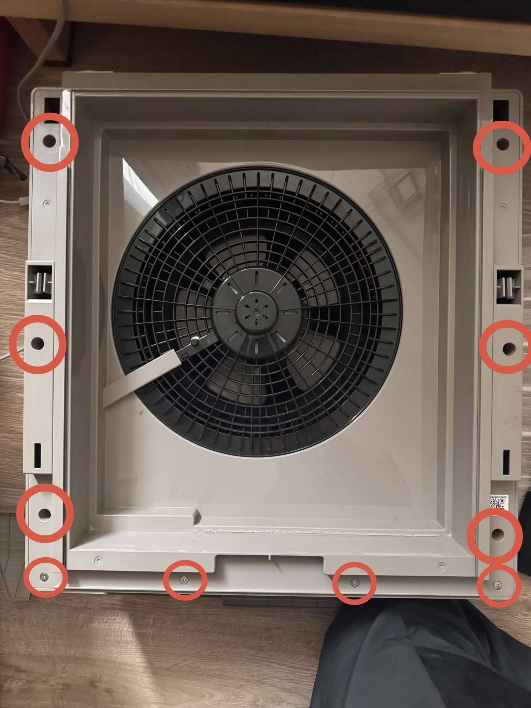
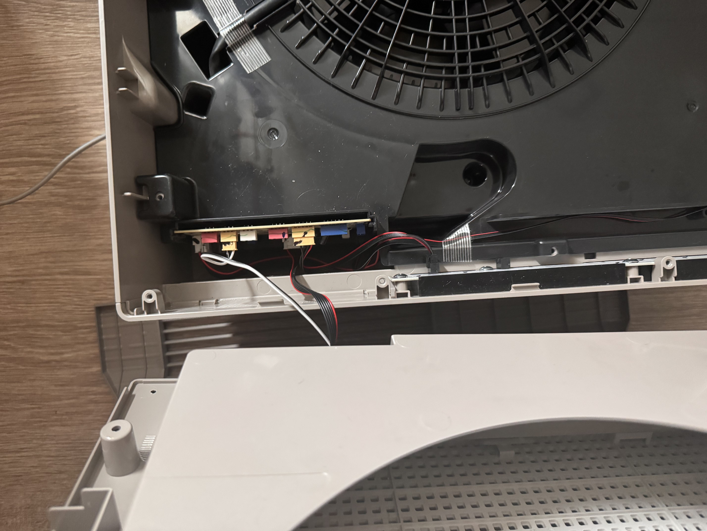
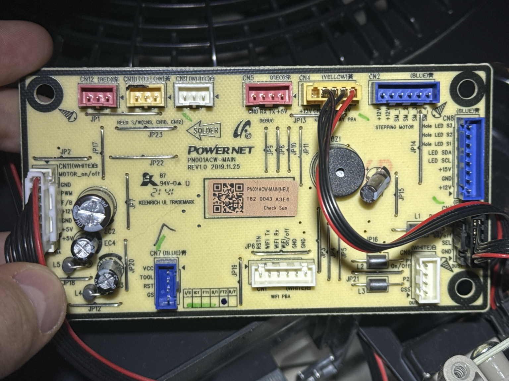
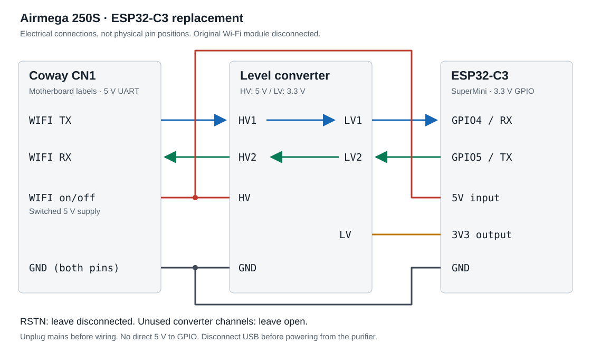
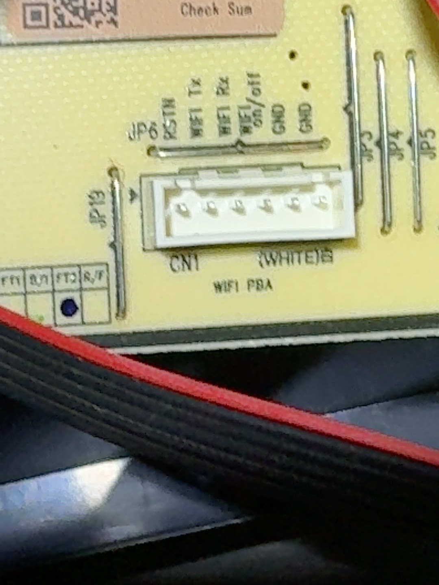

# Coway Airmega 250S · ESPHome

An ESP32-C3 replaces the Airmega 250S Wi-Fi module, giving you local access and control through Home Assistant. The purifier's physical controls remain functional.

Tested on an **Airmega 250S (AP-1720G)** with a **PN001ACW-MAIN Rev. 1.0** motherboard and **MCR-WMDBE-CWP** Wi-Fi module. Other models and board revisions are untested.

## Controls and sensors

| Entity | Controls or readings |
| --- | --- |
| Native fan | Power, three speeds, Auto, Sleep, Rapid |
| Panel lighting | All on, AQI off, all off |
| Off timer | Off, 1, 2, 4, 8 hours |
| Settings | Button lock, Sensitive / Moderate / Insensitive |
| Sensors | PM2.5, PM10, ambient light, pre-filter and MAX2 life remaining |

Fan state comes from the purifier's replies. Three optional bridge diagnostics are disabled by default. Use Home Assistant automations for schedules. Filter resets and the app's pre-filter cleaning interval are not implemented.

## Parts

- ESP32-C3 SuperMini with a 5 V input.
- [8-channel bidirectional 3.3 V / 5 V level converter](https://www.oomipood.ee/en/product/tasememuundur_voltage_translator_8kanaliga_5v33v_bidir), Okystar OKY3460-5. Only two channels are used.
- The original six-wire harness or a matching adapter, insulated wire, heat-shrink, and an insulated mount.
- Phillips screwdriver, multimeter, soldering tools, and a USB data cable.

**Unplug the purifier before opening or wiring it.** This is a mains appliance. Never connect its 5 V UART directly to ESP GPIO. Disconnect USB before powering the ESP from the purifier. Do not join two 5 V supplies.

## 1. Flash the ESP

Leave the ESP disconnected from the purifier for the first USB flash. With Python 3.12–3.14 installed:

```sh
git clone https://github.com/MartinLeisssoo/esphome-coway-airmega-250s.git
cd esphome-coway-airmega-250s
python3 -m venv .venv
. .venv/bin/activate
pip install -r requirements.txt
cp secrets.example.yaml secrets.yaml
```

Edit `secrets.yaml` with your 2.4 GHz Wi-Fi details, an API encryption key, and separate OTA and recovery passwords. Generate the API key with `openssl rand -base64 32`. Generate each password with `openssl rand -hex 16`.

```sh
esphome config coway-250s.yaml
esphome run coway-250s.yaml
```

Select the connected USB serial device when prompted. The supplied configuration targets the SuperMini using ESPHome's `esp32-c3-devkitm-1` board definition and Arduino framework. Tested with ESPHome 2026.8.1.

`secrets.yaml` and build output are ignored by Git. Compiled firmware contains your credentials, so do not publish firmware binaries or unreviewed logs.

## 2. Open the front

1. Unplug the purifier. Remove the front cover and filters.
2. Remove the screws at the marked points below. Keep track of their positions.
3. Ease the front housing away. Support it while checking the attached cables.
4. Find the motherboard and its white six-pin **CN1 / WIFI PBA** connector. Photograph the harness before disconnecting the original Mercury module.



*Front access: the marked screw points are exposed after removing the cover and filters.*



*The opened housing remains attached by cables. Do not pull it free.*



*CN1 is near the lower centre, labelled WIFI PBA.*

## 3. Wire the replacement

Disconnect the original module. Its UART transmitter must not share the line with the ESP transmitter.



| Coway motherboard CN1 | Level converter | ESP32-C3 |
| --- | --- | --- |
| `WIFI TX` | HV1 → LV1 | GPIO4 / RX |
| `WIFI RX` | HV2 ← LV2 | GPIO5 / TX |
| `WIFI on/off` | HV supply | 5V input |
| GND (one pin) | HV-side GND | — |
| — | LV-side GND | GND |
| — | LV supply | 3V3 output |
| RSTN | Not connected | Not connected |

`WIFI on/off` is the module's switched **5 V supply**. It powers both the ESP's 5V input and the converter's HV side.

Connect one CN1 GND pin to the converter's HV-side GND and ESP GND to its LV-side GND. Continuity was confirmed between the converter's two ground pins. Leave the second CN1 GND pin and unused converter channels open.



*Left to right: RSTN, WIFI TX, WIFI RX, WIFI on/off, GND, GND. The connector is keyed and fits one way.*

The [Mercury module manual, page 12](https://fcc.report/FCC-ID/2AVW5MCRWMDBECWP/5488722.pdf) specifies a 5 V supply and 5 V UART levels. Its pin numbers refer to the module connector. Match the motherboard silkscreen and verify the harness with a meter before connecting the ESP.

Insulate the joints and secure both boards away from the fan, mains circuitry, and loose metal. Check for shorts. Refit the housing, filters, and cover before applying mains power.

## 4. Add Home Assistant

Power the reassembled purifier with USB disconnected. In Home Assistant, add the discovered **ESPHome** device and enter the API encryption key. If discovery fails, add it using the ESP's address from your router.

Allow about a minute for startup and state updates. Home Assistant supplies time over the local API, which the command format requires after each ESP restart.

Open the fan entity for power, speed, and presets. **Auto** corresponds to the Coway app's **Smart** mode. Set **AQI off** to extinguish the large air-quality light while leaving the small control indicators on.

## Checks and limits

- **Readings work, controls do not:** check Home Assistant time sync, then the ESP TX → converter → Coway RX path. UART is 115200 baud, 8N1.
- **No readings:** check shared ground, converter supplies, and Coway TX → ESP RX. Never bypass the converter.
- **State briefly unknown after restart:** the bridge queries the purifier after time sync and every 60 seconds.
- **Ambient light:** uses the 250S correction `max(1022 − raw, 0)` from [ha-coway](https://github.com/Antonio112009/ha-coway/blob/main/custom_components/ha_coway/sensor.py). Lux values have not been independently calibrated.

The original module was removed for successful local control tests covering power, speeds, modes, lighting, timer, sensitivity, and lock. Native fan sequencing was also tested. Long-term reliability and other board revisions remain unverified. The original Coway app no longer controls the purifier after the conversion.

See [protocol notes](docs/protocol.md), [host tests](tests/README.md), and [hardware reference photos](docs/hardware.md). Handshake work draws on [esphome-winix-c545](https://github.com/mill1000/esphome-winix-c545). [MIT licence](LICENSE), with [third-party notices](THIRD_PARTY_NOTICES.md).
