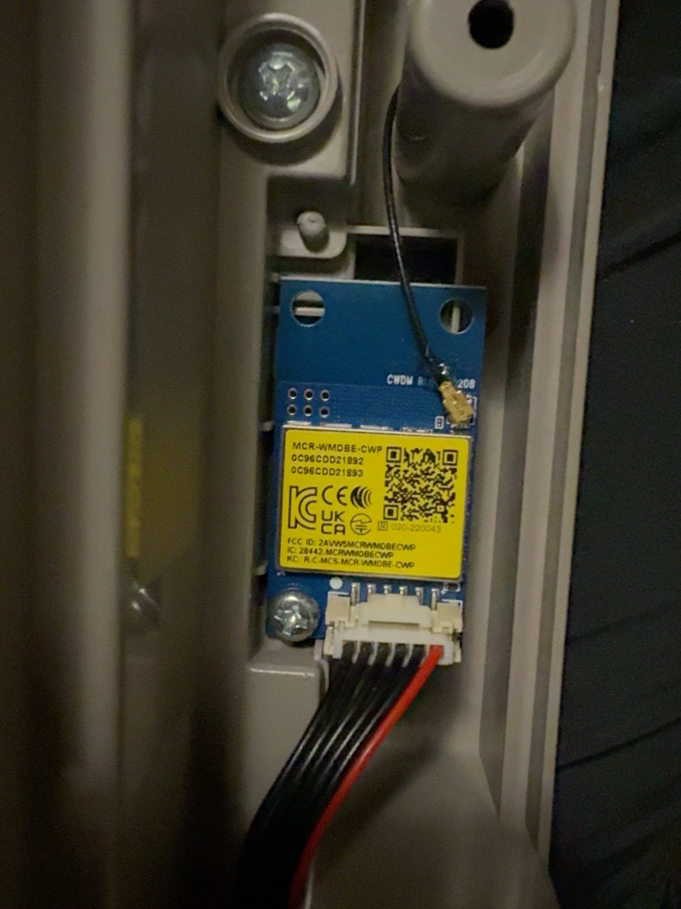
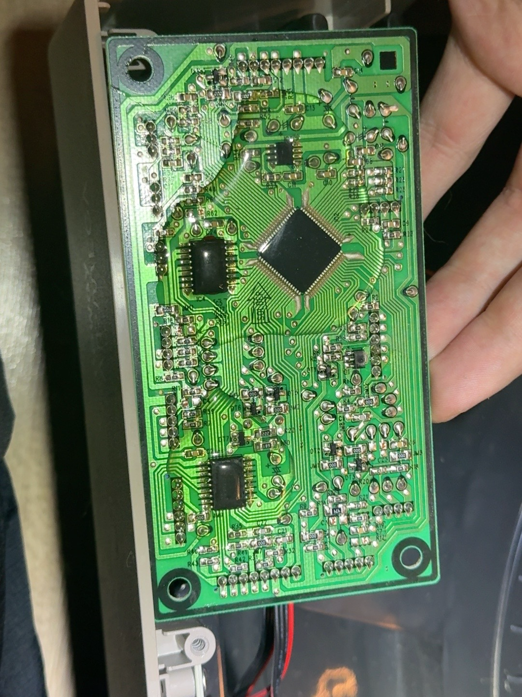

# Hardware reference

These photos document the tested unit. The installation steps and wiring are in the [tutorial](../README.md).

## Original Wi-Fi module

The ESP replaces this Mercury MCR-WMDBE-CWP module. Retain the original board if you want to reverse the conversion. Disconnect it completely for normal ESP operation.

## Motherboard solder side

Connect the ESP through the existing CN1 harness. The motherboard and its firmware stay unchanged.

## Photo index

- [Front screw positions](images/front-screws.jpg)
- [Opened front housing](images/front-open.jpg)
- [Motherboard component side](images/motherboard-front.png)
- [CN1 labels](images/cn1-pinout.png)
- [Original Wi-Fi module](images/original-module.png)
- [Motherboard solder side](images/motherboard-back.png)

Photos supplied by the project author. Embedded photo metadata has been removed.
